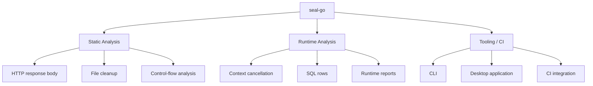

# seal-go

seal-go is a Go resource cleanup analyzer.

It helps detect resources that are acquired but not properly released. The project supports static source-code analysis and runtime resource tracking.

It combines three parts:

- **Static Analysis:** Inspects source code without running it.
- **Runtime Analysis:** Tracks resources while the program runs.
- **Tooling / CI:** Provides CLI, desktop and automated check integrations.




## Features

### Static analysis

seal-go analyzes Go source code without running the application.

Current checks include:

- Unclosed HTTP response bodies
- Unclosed files
- HTTP calls made through `http.Client`
- Aliased `net/http` imports
- Context cancellation checks under development

### Runtime tracking

The `runtimecheck` package tracks resources while an application is running.

Current runtime checks include:

- Context cancellation:
  - `WithCancel`
  - `WithTimeout`
  - `WithDeadline`
- SQL rows cleanup:
  - `Query`
  - `QueryContext`
  - `Rows.Close`
  - Completed rows iteration

## Static analysis usage

Analyze the current project:

```bash
go run ./cmd/seal-go ./...
```

Analyze a specific package:

```bash
go run ./cmd/seal-go ./example
```

## Runtime tracking usage

Create a tracker:

```go
tracker := runtimecheck.NewTracker()
```

### Context tracking

```go
ctx, cancel := runtimecheck.WithTimeout(
    tracker,
    context.Background(),
    5*time.Second,
)
defer cancel()

_ = ctx
```

### SQL rows tracking

```go
rows, err := runtimecheck.QueryContext(
    tracker,
    db,
    context.Background(),
    "SELECT id FROM users",
)
if err != nil {
    return err
}
defer rows.Close()
```

### Inspect open resources

```go
for _, resource := range tracker.OpenResources() {
    fmt.Printf(
        "open resource: id=%d kind=%s created=%s\n",
        resource.ID,
        resource.Kind,
        resource.CreatedAt,
    )
}
```

## Desktop application

seal-go includes a desktop application for selecting and analyzing Go projects.

Run it in development mode:

```bash
cd desktop
wails dev
```

## Development status

- [x] HTTP response body analysis
- [x] File cleanup analysis
- [x] Context runtime tracking
- [x] SQL rows runtime tracking
- [ ] SQL transaction tracking
- [ ] HTTP response runtime tracking
- [ ] Runtime report output
- [ ] Runtime results in the desktop application
- [ ] Control-flow-aware cleanup analysis

## Testing

Run all tests:

```bash
go test ./...
```

Run runtime tracking tests:

```bash
go test ./runtimecheck -v
```

Run race detection:

```bash
go test -race ./runtimecheck
```

## License

seal-go is open-source software licensed under the MIT License.